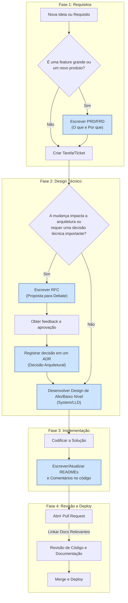

# Fluxo de Trabalho de Documentação e Desenvolvimento

Este documento descreve o fluxo de trabalho padrão para o desenvolvimento de novas funcionalidades e a manutenção da arquitetura no projeto `buzz-saas`. O objetivo é integrar a criação de documentação de forma orgânica ao ciclo de desenvolvimento, garantindo clareza, compartilhamento de conhecimento e decisões bem fundamentadas.

## O Fluxo em 4 Fases



---

## Detalhes das Fases e Documentos

### Fase 1: Concepção e Requisitos
- **Gatilho:** Uma nova demanda de negócio ou uma melhoria significativa.
- **Documento Principal:** `PRD` (Product Requirements Doc) ou `FRD` (Feature Requirements Doc).
- **Objetivo:** Definir **o quê** será construído e **por quê**, focando nas regras de negócio e nos requisitos do usuário, sem entrar em detalhes técnicos.

### Fase 2: Desenho da Solução Técnica (Antes de Codificar)
- **Gatilho:** A complexidade da solução exige um planejamento técnico detalhado, ou há uma mudança estrutural no sistema.
- **Documentos:**
    - `RFC (Request for Comments)`: Para propor mudanças técnicas que se beneficiam do debate da equipe. É um documento para gerar consenso.
    - `ADR (Architecture Decision Record)`: Após a decisão ser tomada, ela é registrada em um ADR. É um log imutável das decisões arquiteturais importantes.
    - `System Design (Alto Nível)` ou `LLD (Baixo Nível)`: Para sistemas mais complexos, detalha como os componentes irão interagir e como cada parte será implementada.

### Fase 3: Implementação (Durante a Codificação)
- **Gatilho:** Processo contínuo durante o desenvolvimento.
- **Documentação:**
    - **Comentários no Código:** Explicam o "porquê" de lógicas complexas, não o "o quê".
    - **`README.md`:** Todo módulo ou serviço deve ter um `README.md` explicando sua finalidade, como configurá-lo e usá-lo.

### Fase 4: Revisão e Entrega
- **Gatilho:** Abertura de um Pull Request (PR).
- **Prática:** A descrição do PR deve conter links para os documentos de design relevantes (FRD, ADR, etc.). A revisão do código deve incluir também a revisão da documentação associada. 

---

## 5. Versionamento e Deploy

Toda alteração significativa, especialmente a criação ou atualização de um documento de arquitetura ou design (ADR, LLD, RFC), deve ser acompanhada por um incremento de versão.

1.  **Incremento de Versão:** Após a criação/alteração da documentação, a versão no arquivo `package.json` deve ser incrementada seguindo o Versionamento Semântico:
    -   **PATCH:** Para correções de bugs, documentação, ou pequenas melhorias que não afetam a API.
    -   **MINOR:** Para novas funcionalidades que são retrocompatíveis.
    -   **MAJOR:** Para mudanças que quebram a compatibilidade (breaking changes).
2.  **Gerar o Changelog:** Antes de commitar a mudança de versão, atualize o changelog automaticamente executando o script:
    ```bash
    npm run docs:changelog
    ```
3.  **Commit e Push:** Todas as alterações (código, documentação, changelog e `package.json`) devem ser commitadas e enviadas ao repositório remoto. Use a convenção de commits para descrever a mudança.
    -   Exemplo de commit para documentação: `docs(adr): cria ADR para processamento síncrono de webhooks`
    -   Exemplo de commit para versionamento: `chore(release): bump version to 0.4.0` 