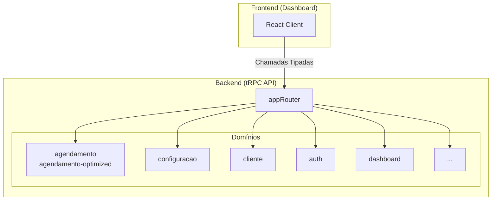

# Low-Level Design: API tRPC

**Status:** Rascunho
**Documento Pai:** [System Design (High-Level)](./001-system-design-hld.md)

## 1. Introdução

Este documento detalha a arquitetura da API interna baseada em **tRPC**. Esta API é a principal interface de comunicação entre o nosso frontend (Dashboard) e o backend, garantindo segurança de tipos de ponta a ponta. A raiz da nossa API está definida em `src/server/api/root.ts`, que agrega todos os `routers` individuais.

## 2. Visão Geral dos Routers

A API é modularizada em `routers`, onde cada um agrupa um conjunto de `procedures` (queries e mutations) relacionadas a um domínio de negócio específico.

## 3. Detalhamento dos Principais Routers

Os `routers` estão localizados em `src/server/api/routers/`.

-   **`auth.ts`**
    -   **Responsabilidade:** Gerencia a autenticação dos usuários do dashboard.
    -   **Principais Procedures:**
        -   `login`: Autentica um usuário com base em credenciais.
        -   `getSession`: Obtém a sessão do usuário atualmente logado.
        -   `logout`: Invalida a sessão do usuário.

-   **`agendamento.ts` e `agendamento-optimized.ts`**
    -   **Responsabilidade:** Lida com todas as operações relacionadas a agendamentos.
    -   **`agendamento.ts`:** Contém a lógica principal e mais completa para CRUD (Criar, Ler, Atualizar, Deletar) de agendamentos.
    -   **`agendamento-optimized.ts`:** Provavelmente contém queries otimizadas para cenários de alta performance ou leituras específicas, como as exibidas em calendários ou listas densas, para evitar o tráfego de dados desnecessários.
    -   **Principais Procedures:** `getAll`, `create`, `updateStatus`, `delete`.

-   **`cliente.ts`**
    -   **Responsabilidade:** Gerencia as informações dos clientes finais.
    -   **Principais Procedures:** `getAll`, `create`, `update`, `search`.

-   **`configuracao.ts`**
    -   **Responsabilidade:** Gerencia as configurações gerais do sistema para uma conta (tenant). Inclui configurações de IA, horários de funcionamento, serviços oferecidos, etc.
    -   **Principais Procedures:** `get`, `update`.

-   **`intervalo-trabalho.ts`**
    -   **Responsabilidade:** Gerencia os horários de trabalho e folgas dos profissionais, que são a base para o cálculo de disponibilidade.
    -   **Principais Procedures:** `getAll`, `create`, `delete`.

-   **`dashboard.ts`**
    -   **Responsabilidade:** Fornece dados agregados e estatísticas para a página principal do dashboard.
    -   **Principais Procedures:** `getStats`, `getRecentAppointments`, `getOverviewData`.

-   **`agents.ts`, `conversations.ts`, `messages.ts`**
    -   **Responsabilidade:** Este conjunto de routers parece gerenciar a lógica relacionada ao chatbot, como o estado das conversas, o histórico de mensagens e a configuração dos "agentes" de IA.

-   **`linktree.ts`**
    -   **Responsabilidade:** Gerencia a funcionalidade de "Linktree", possivelmente uma página pública com links para agendamento e redes sociais.

## 4. Fluxo de uma Chamada tRPC

1.  No frontend, um componente React chama uma procedure da API usando o hook `api.useQuery` ou `api.useMutation`. Ex: `api.dashboard.getStats.useQuery()`.
2.  O cliente tRPC do Next.js envia uma requisição HTTP para o endpoint correspondente no backend.
3.  O `appRouter` no backend direciona a chamada para o `router` e a `procedure` corretos (ex: `dashboardRouter.getStats`).
4.  A procedure executa a lógica de negócio (ex: consultar o banco de dados via Drizzle).
5.  O resultado é serializado e retornado ao frontend.
6.  O hook `useQuery` no frontend recebe os dados, que são totalmente tipados, e atualiza o estado do componente.

