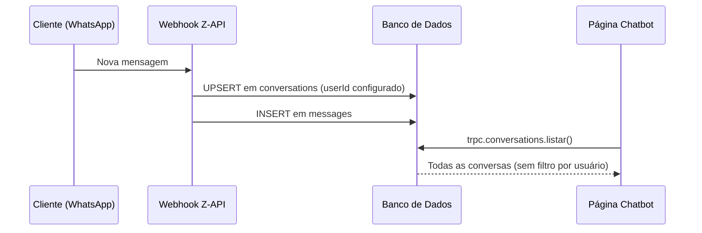

# LLD: Listagem de Conversas no Dashboard Chatbot

**Status:** Implementado  
**Documento Pai:** [LLD: API de Webhooks](./002-webhooks-api-lld.md)

---

## 1. Objetivo

Permitir que a página **Dashboard → Chatbot** exiba todas as conversas registradas no sistema, independentemente do usuário que as originou, garantindo visibilidade imediata sempre que novas mensagens chegarem via WhatsApp.

## 2. Requisitos

| ID | Descrição |
|----|-----------|
| LLD05-1 | A listagem não deve filtrar por `user_id`; todas as entradas da tabela `conversations` devem ser retornadas. |
| LLD05-2 | Conversas devem ser criadas/atualizadas assim que o webhook `/api/webhooks/zapi` receber uma mensagem. |
| LLD05-3 | É possível, opcionalmente, definir `CHATBOT_USER_ID` no `.env` para associar novas conversas a um usuário específico; caso não exista, usa‐se o primeiro usuário da tabela `users`. |
| LLD05-4 | Logs detalhados devem facilitar o debug (parâmetros de listagem, condições SQL, total de registros). |

## 3. Componentes Envolvidos

| Componente | Arquivo | Alterações |
|------------|---------|-----------|
| Router tRPC – Conversas | `src/server/api/routers/conversations.ts` | • Removido filtro `userId` na query `listar`.  
• Adicionados logs (`console.log`) para debug. |
| Webhook Z-API | `src/app/api/webhooks/zapi/route.ts` | • Variável `CHATBOT_USER_ID` para forçar o `userId`. |
| Variáveis de Ambiente | `src/env.js` | • `CHATBOT_USER_ID` adicionada ao schema. |
| Frontend Chatbot | `src/app/dashboard/chatbot/page.tsx` | Sem alterações; passou a receber dados completos. |

## 4. Fluxo Atualizado



## 5. Configuração

1. Abra `.env` e (opcionalmente) defina:
   ```
   CHATBOT_USER_ID=2
   ```
   Se omitido, o webhook usará o primeiro registro da tabela `users`.
2. Reinicie o servidor (`npm run dev` ou re-deploy).

## 6. Considerações Finais

• A remoção do filtro garante visibilidade total, porém, em ambientes multi‐tenant isso deve ser revisitado (sugestão: `tenant_id`).  
• Logs podem ser silenciados em produção usando o nível de log ou flag de ambiente.  
• Para conversas antigas associadas a outro `user_id`, basta executar:
  ```sql
  UPDATE conversations SET user_id = 2;
  ``` 