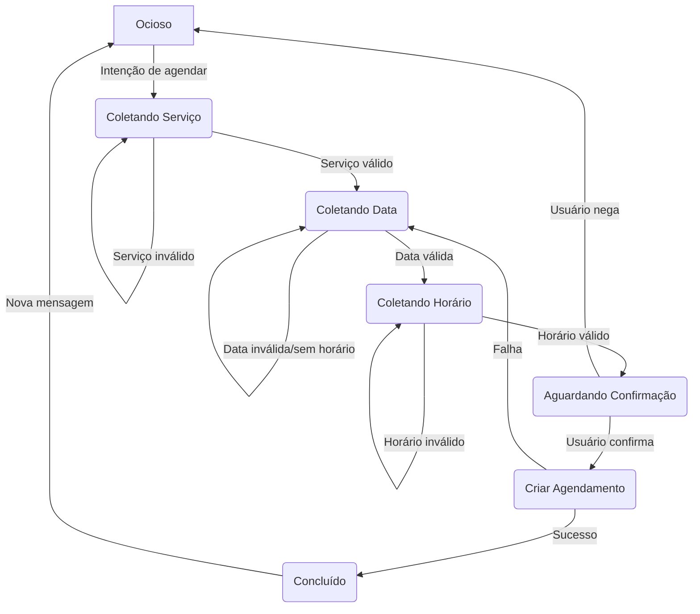

# LLD 006: Orquestração Determinística do Chatbot de Agendamento

**Status:** Implementado  
**Documentos Pais:** [LLD: AI Service](./004-ai-service-lld.md), [ADR: Processamento Síncrono de Webhooks](../adr/0002-sync-webhook-processing.md)

---

## 1. Problema

O agente de IA anterior operava em um modo puramente conversacional, levando a dois problemas críticos:
1.  **Falta de Memória de Estado:** O agente não reconhecia a conclusão de um agendamento, podendo solicitar as mesmas informações repetidamente.
2.  **Alucinação de Disponibilidade:** O agente sugeria e confirmava agendamentos em horários fora do expediente ou já ocupados por não validar as informações contra uma fonte da verdade em cada etapa.

## 2. Solução: Orquestrador com Máquina de Estados

A solução foi refatorar o webhook principal (`/api/webhooks/zapi/route.ts`) para atuar como um **orquestrador de fluxo determinístico**, abandonando a lógica de estado interna e complexa que existia no `ai-service`.

A IA agora é usada como uma ferramenta de **extração de dados**, enquanto o controle do fluxo da conversa é gerenciado por uma **máquina de estados** persistida no banco de dados.

### 2.1. Persistência do Estado

-   **O quê:** Uma coluna `memoria_contexto` do tipo `JSONB` foi adicionada à tabela `conversations`.
-   **Conteúdo:** Ela armazena um objeto que representa o estado atual da conversa. Exemplo:
    ```json
    {
      "status": "coletando_data",
      "servicoId": 1,
      "servicoNome": "Corte de Cabelo",
      "data": null,
      "horario": null
    }
    ```

### 2.2. Fluxo da Máquina de Estados

O orquestrador (`gerenciarEstadoConversa`) guia o usuário através dos seguintes estados:



### 2.3. Validações Estritas

-   **Seleção de Serviço:** O sistema só avança se o serviço mencionado pelo usuário existir e estiver ativo no banco de dados.
-   **Disponibilidade de Horários:** A lista de horários é sempre gerada em tempo real pelo webhook `/listar-horarios`.
-   **Validação de Horário Escolhido:** O sistema verifica se o horário escolhido pelo usuário estava na lista de opções que foi apresentada.
-   **Validação Final na Criação:** O webhook `/criar-agendamento` realiza uma verificação de disponibilidade final e atômica antes de inserir o registro no banco, prevenindo `race conditions`.

## 3. Componentes Modificados

| Componente | Arquivo | Alterações Principais |
|------------|---------|-----------|
| **Schema do Banco** | `src/server/db/schema.ts` | Adicionada coluna `memoria_contexto` (`jsonb`) à tabela `conversations`. |
| **Migração SQL** | `drizzle/0002...` | Script para aplicar a alteração da coluna no banco. |
| **Webhook Z-API** | `src/app/api/webhooks/zapi/route.ts` | • Implementado o orquestrador `gerenciarEstadoConversa`.<br/>• Lógica de `processMessage` totalmente refatorada. |
| **AI Service** | `src/lib/ai-service.ts` | • Adicionado método `extractData` para extração de dados direcionada.<br/>• Removida a lógica de estado interna e conflitante. |
| **Webhooks de Ação** | `.../listar-horarios` e `.../criar-agendamento`| Adicionadas validações mais estritas para garantir a conformidade com as regras de negócio. |

## 4. Consequências

-   **Positivas:**
    -   O fluxo de agendamento tornou-se **confiável e previsível**.
    -   Eliminada a possibilidade de agendamentos inválidos.
    -   O agente agora tem uma memória de estado clara (sabe quando um agendamento foi concluído).
    -   O código do orquestrador é mais simples e fácil de depurar.
-   **Negativas:**
    -   O fluxo é mais rígido. O usuário é guiado passo a passo e tem menos liberdade para fornecer todas as informações de uma vez. (Isso pode ser melhorado no futuro, permitindo que o orquestrador pule estados se a informação já estiver disponível). 