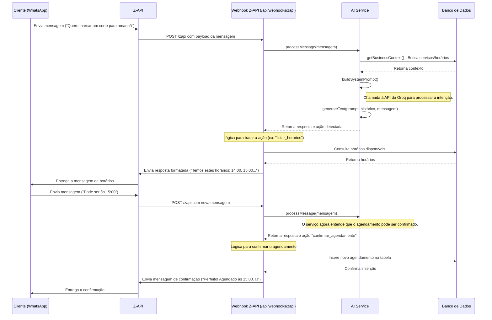

# Diagrama de Sequência UML: Agendamento via Chatbot

**Status:** Rascunho
**Documentos Relacionados:** [FRD: Agendamento via Chatbot](../../product/002-frd-chatbot-scheduling.md), [LLD: AI Service](../../design/004-ai-service-lld.md)

## 1. Introdução

Este diagrama de sequência ilustra o fluxo de interações entre os diversos componentes do sistema durante o processo de agendamento de um serviço por um cliente final através do WhatsApp. Ele detalha a ordem das chamadas, desde a mensagem do usuário até a confirmação final.

## 2. Diagrama de Sequência

## 3. Descrição dos Passos

1.  O **Cliente** envia uma mensagem inicial via WhatsApp.
2.  A **Z-API** recebe essa mensagem e a encaminha para o nosso **Webhook Z-API**.
3.  O Webhook invoca o **`AIService`** para interpretar a mensagem.
4.  O `AIService` primeiro busca o contexto de negócio (serviços, etc.) no **Banco de Dados**.
5.  Em seguida, o `AIService` chama o modelo de linguagem para entender a intenção e gerar uma resposta.
6.  O Webhook recebe a resposta e a ação. Neste caso, a ação pode ser consultar horários disponíveis, então ele faz uma nova chamada ao **Banco de Dados**.
7.  O Webhook formata os horários e envia a resposta para o cliente através da **Z-API**.
8.  O cliente escolhe um horário. Este ciclo se repete.
9.  Quando o `AIService` detecta que tem todas as informações, o Webhook recebe uma ação para confirmar.
10. O Webhook insere o novo agendamento no **Banco de Dados**.
11. Uma mensagem final de confirmação é enviada ao cliente. 