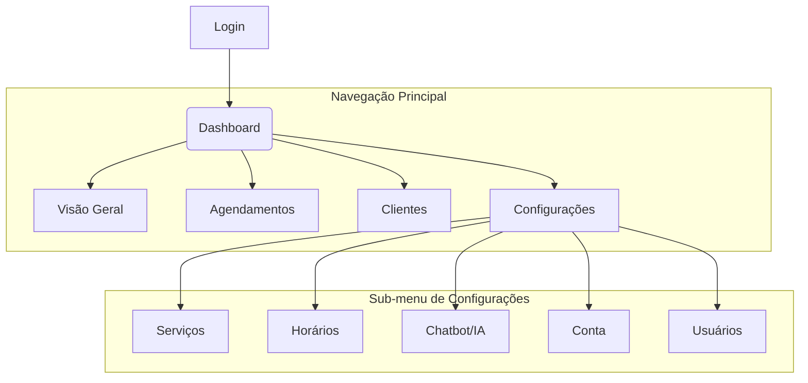

# FRD: Dashboard de Gestão

**Status:** Rascunho
**Documento Pai:** [PRD: buzz-saas](./001-prd-buzz-saas.md)

## 1. Visão Geral da Funcionalidade

O Dashboard de Gestão é a interface web central para os administradores do negócio. Através dele, os usuários podem configurar o sistema, gerenciar seus dados operacionais (agendamentos, clientes) e obter uma visão geral da performance do negócio.

## 2. Personas de Usuário

-   **Administrador/Dono do Negócio:** Tem acesso a todas as funcionalidades, incluindo configurações de faturamento e gestão de usuários.
-   **Recepcionista/Funcionário:** Tem acesso a funcionalidades operacionais, como visualizar e gerenciar agendamentos e clientes.

## 3. Requisitos Funcionais Detalhados

| ID      | Módulo/Página         | Requisito                                                                                                                              |
| ------- | --------------------- | -------------------------------------------------------------------------------------------------------------------------------------- |
| FRD02-1 | **Página Principal (Dashboard)** | Exibir estatísticas chave: total de agendamentos, receita estimada, novos clientes. Apresentar um resumo dos próximos agendamentos e uma visão geral do calendário. |
| FRD02-2 | **Página de Agendamentos** | Listar todos os agendamentos (passados e futuros) com filtros (por data, status, cliente). Permitir a criação manual, edição e cancelamento de agendamentos. |
| FRD02-3 | **Página de Clientes**     | Listar todos os clientes cadastrados. Permitir a visualização de detalhes de um cliente, incluindo seu histórico de agendamentos. Adicionar ou editar clientes manualmente. |
| FRD02-4 | **Página de Configurações - Serviços** | CRUD completo para os serviços oferecidos. Campos: Nome, Descrição, Preço, Duração, Ativo/Inativo.                                 |
| FRD02-5 | **Página de Configurações - Horários** | Interface para definir os intervalos de trabalho para cada dia da semana, incluindo a possibilidade de definir folgas e pausas. |
| FRD02-6 | **Página de Configurações - IA** | Configurar o comportamento do chatbot, como a mensagem de saudação e outras personalizações. (Futuro) Visualizar logs de conversas. |
| FRD02-7 | **Página de Configurações - Conta** | Gerenciar informações da conta do usuário administrador, como nome, email e senha.                                      |
| FRD02-8 | **Autenticação**          | Sistema de login seguro para acessar o dashboard. Controle de acesso baseado no papel do usuário (admin vs. funcionário).       |

## 4. Estrutura de Navegação

## 5. Documentos Técnicos Relacionados

-   [LLD: API tRPC](../design/003-trpc-api-lld.md)
-   [ADR: Uso de Redis para Cache](../adr/0001-use-redis-for-caching.md) (Relevante para a performance do dashboard) 