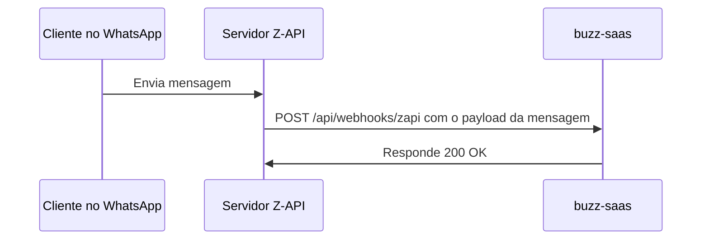
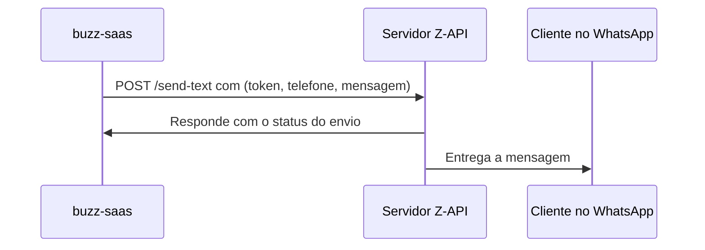

# TRD: Integração com Z-API

**Status:** Rascunho
**Documento Pai:** [PRD: buzz-saas](./001-prd-buzz-saas.md)

## 1. Visão Geral da Integração

Esta integração conecta o `buzz-saas` com a plataforma Z-API, permitindo que nossa aplicação envie e receba mensagens do WhatsApp de forma programática. Esta é a integração fundamental que viabiliza toda a funcionalidade do chatbot de agendamento.

## 2. Requisitos Técnicos

| ID      | Requisito                             | Descrição Detalhada                                                                                                                                                                                           |
| ------- | ------------------------------------- | ------------------------------------------------------------------------------------------------------------------------------------------------------------------------------------------------------------- |
| TRD01-1 | **Recebimento de Mensagens (Webhook)**  | O `buzz-saas` deve expor um endpoint de webhook público (`/api/webhooks/zapi`) para receber notificações de novas mensagens do Z-API.                                                                      |
| TRD01-2 | **Envio de Mensagens**                  | O `buzz-saas` deve ser capaz de enviar mensagens de texto para os usuários do WhatsApp através da API REST do Z-API. Isso é encapsulado no `ZapiService`.                                                    |
| TRD01-3 | **Configuração da Integração**          | O administrador deve poder configurar as credenciais necessárias para a integração no dashboard: `API Token`, `Client Token` e `Instance ID` do Z-API. Essas credenciais devem ser armazenadas de forma segura. |
| TRD01-4 | **Segurança do Webhook**                | O endpoint de webhook deve ser protegido contra chamadas não autorizadas. No mínimo, deve-se usar um token secreto compartilhado. Idealmente, validação de assinatura HMAC.                               |
| TRD01-5 | **Tratamento de Erros**                 | O sistema deve ser resiliente a falhas na API do Z-API. Tentativas de envio de mensagem devem ter retentativas (retries) e logging de erros. Falhas no recebimento não devem quebrar a aplicação.           |

## 3. Fluxo de Dados

### Recebendo uma Mensagem



### Enviando uma Mensagem



## 4. Estrutura do Payload (Simplificado)

**Payload Recebido (do Z-API para nós):**

```json
{
  "instanceId": "...",
  "messageId": "...",
  "timestamp": 1678886400,
  "phone": "5511999998888",
  "message": {
    "type": "text",
    "text": {
      "message": "Olá, gostaria de agendar um horário."
    }
  },
  "sender": {
    "name": "João da Silva"
  }
}
```

**Payload Enviado (de nós para o Z-API):**

```json
{
  "phone": "5511999998888",
  "message": "Olá, João! Claro, para qual dia você gostaria de agendar?"
}
```

## 5. Documentos Técnicos Relacionados

-   [LLD: API de Webhooks](../design/002-webhooks-api-lld.md)
-   `src/lib/zapi-service.ts` (Implementação do cliente da API) 